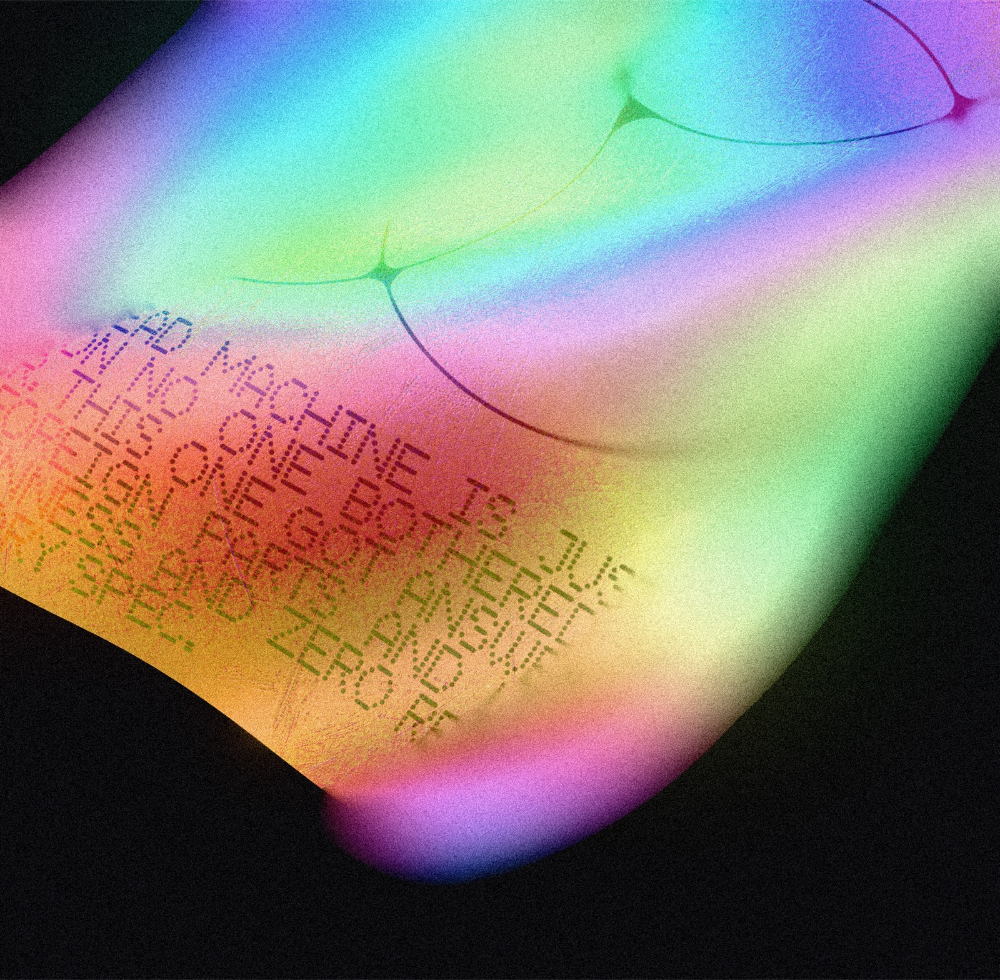

# Holocloth

A little browser tool for playing with holographic fabric.

You get a sheet of simulated cloth floating in space. You can grab it, throw it around, drape your own images over it, and watch them ripple like they're printed on holo foil. When it looks good — export a PNG.



## What it does

- **Real cloth physics** — grab the sheet and pull. It wrinkles, settles, and floats like fabric in gel. Written from scratch (Verlet integration, no physics library).
- **Holographic material** — an iridescent foil shader with rainbow diffraction, sparkle, and bump maps. Also chrome and black cloth presets.
- **Your images** — upload any image or SVG and it becomes the cloth, or a sticker on top of it. Everything bends and folds with the fabric.
- **Camera looks** — macro depth of field (click to pick a focus point), ambient occlusion in the folds, film grain, bloom.
- **Export** — one click PNG, with or without the background.
- **Versions** — save looks and switch between them while you work.

## Controls

| Action | How |
|---|---|
| Grab the cloth | Click + drag on it |
| Orbit the camera | Drag empty space |
| Pan | Hold `Space` + drag, or right-drag |
| Zoom | Scroll |
| Move a sticker | Turn on `Edit` in the Images panel, then drag it |

## Run it

```bash
npm install
npm run dev
```

That's it. Open the local URL Vite prints.

## Tech

- [Three.js](https://threejs.org) (WebGL 2) — rendering
- [React](https://react.dev) + TypeScript + [Vite](https://vite.dev)
- Custom GLSL: the holo foil shader, a circle-of-confusion depth of field pass, film grain
- Custom cloth simulation: Verlet integration with structural, shear, and bend constraints
- [DialKit](https://github.com/joshpuckett/dialkit) by [Josh Puckett](https://x.com/joshpuckett) — the control panel UI

## Credits

Made by [Dmitry Kurash](https://x.com/DmitryKurash).

UI powered by [DialKit](https://github.com/joshpuckett/dialkit) — a lovely little library by [Josh Puckett](https://x.com/joshpuckett) for dialing in interface parameters.
